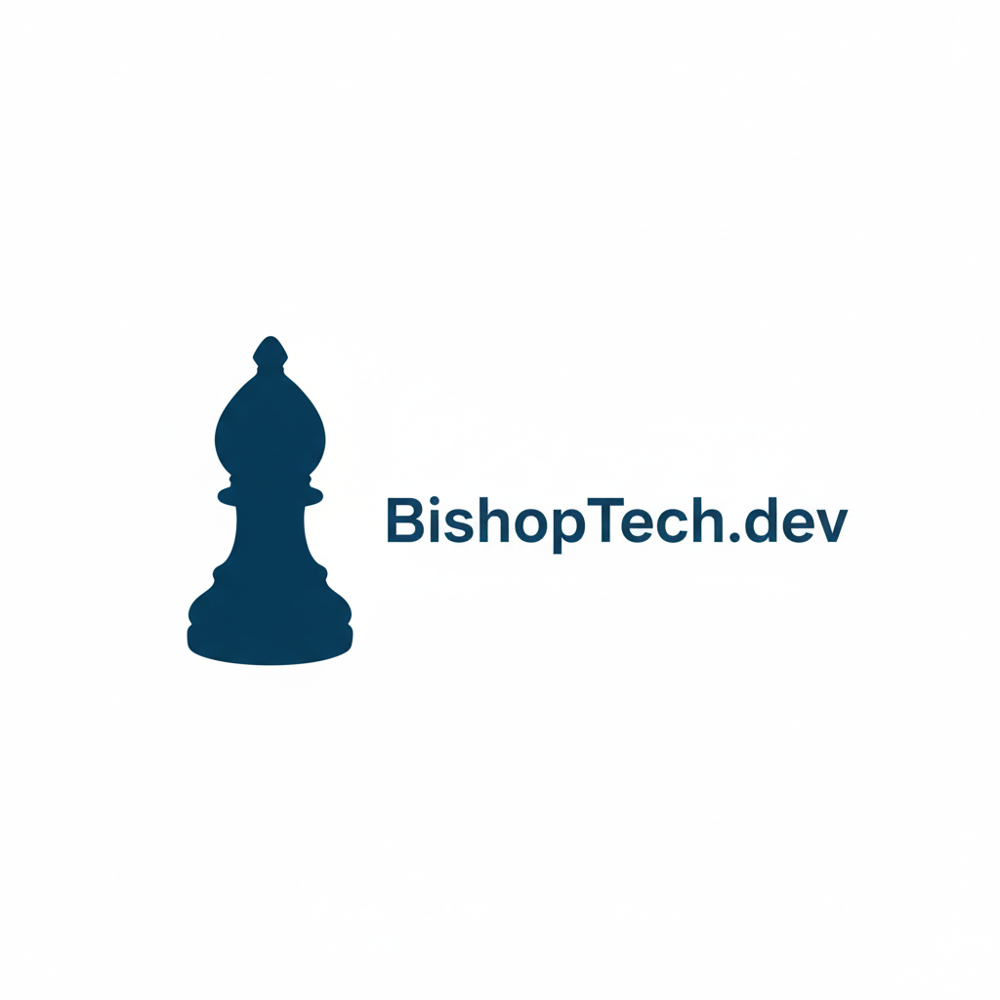

<p align="center">
  
</p>

<h1 align="center">BISHOP</h1>

<p align="center">
  <strong>Local-first operator platform for terminal-native AI work.</strong>
</p>

<p align="center">
  Slack + Dashboard + Gemini/Codex CLIs + Durable local memory + MCP-aware context
</p>

<p align="center">
  <a href="#what-bishop-is"><strong>What it is</strong></a>
  ·
  <a href="#how-it-works"><strong>How it works</strong></a>
  ·
  <a href="#quickstart"><strong>Quickstart</strong></a>
  ·
  <a href="docs/BISHOP_SYSTEM.md"><strong>System Brief</strong></a>
  ·
  <a href="docs/BISHOP_USE_CASES.md"><strong>Use Cases</strong></a>
  ·
  <a href="docs/GEMINI_MCP_PROJECTS.md"><strong>Gemini + MCP Docs</strong></a>
</p>

<p align="center">
  <code>@BISHOP</code> for brainstorming
  ·
  <code>/cli</code> for Gemini execution
  ·
  <code>/codex</code> for Codex execution
  ·
  <code>http://localhost:3113</code> for dashboard visibility
</p>

---

## What BISHOP is

BISHOP turns Slack and a dashboard into a control plane for real Gemini and Codex CLI sessions while keeping execution on your machine.

It is intentionally different from a hosted agent product:
- the work happens in visible local terminals
- the same session can be observed from Slack and the dashboard
- durable context is stored locally
- MCP use is optional and project-scoped
- the orchestration layer stays small enough to debug and extend

If you want a local, inspectable, low-lock-in operator stack instead of a black box, this is that.

## What BISHOP does

- Starts real Gemini or Codex terminal sessions from Slack.
- Streams output, logs, status, and operator controls back to Slack threads and the dashboard session view.
- Lets you continue a running session from Slack thread replies and Slack action buttons.
- Keeps durable local context in markdown files, SQLite, and project-specific settings.
- Tracks useful system paths so the runtime can reason from actual files instead of guessing.
- Supports a curated MCP registry and project Gemini settings generation when tools are needed.

## How it works

BISHOP is built as a thin control plane on top of existing tools.

1. A user sends a request from Slack.
2. The request is queued through Redis/RQ.
3. The local worker launches the appropriate CLI session in Terminal.
4. Output is streamed back to Slack and mirrored into the dashboard.
5. Follow-up input is routed back into the same live session from Slack.
6. Durable context is updated locally for future runs.

That gives you a single operational loop with clear state and predictable failure points.

## Control surfaces

### Slack

Slack is the fastest way to start and steer work.

Use it to:
- launch sessions
- ask for brainstorming/help
- continue a live run in-thread
- review output and final summaries

Example commands:

```text
@BISHOP give me a launch plan for the dashboard
/cli inspect this repo and fix the failing listener test
/codex scaffold a new route and summarize the changes
```

How to use it:
1. Mention `@BISHOP` for lightweight brainstorm/help responses.
2. Use `/cli` when you want Gemini to execute a task in a real terminal session.
3. Use `/codex` when you want Codex to execute the task.
4. Reply in the thread to continue the same session.

### Dashboard

The dashboard is the local operator UI at `http://localhost:3113`.

Use it to:
- inspect active and past sessions
- view live output and logs
- inspect controller state and suggested Slack controls
- browse memory and environment context

How to use it:
1. Start BISHOP locally.
2. Open `http://localhost:3113`.
3. Inspect sessions, logs, and controller state from the UI.
4. Continue the session from Slack using thread replies or the action buttons.

### Terminal execution

This is where the real work happens.

BISHOP launches:
- Gemini in terminal-native mode such as `gemini --yolo`
- Codex in runtime-specific modes such as `codex exec --full-auto`

Why this matters:
- you can see the actual session
- you keep the runtime on your machine
- logs and output remain inspectable
- you avoid inventing a separate proprietary agent runtime

How to use it directly:
- run `./start.sh` to bring up the full stack
- run `./.venv/bin/python local_worker.py` to start the worker only
- run `./.venv/bin/python app.py` to start the Slack listener only

## Runtime model

### `@BISHOP`

Use `@BISHOP` for lightweight drafting, brainstorming, and routing help.

It:
- prefers Gemini API when available
- can fall back to a signed-in local Gemini CLI and then OpenAI when needed
- does not claim terminal execution
- is best for fast, conversational assistance

### `/cli`

Use `/cli` when you want Gemini to actually do the work in a terminal.

It:
- launches Gemini in a real local session
- waits for the prompt to be ready before sending the request
- keeps the run attached to one Slack thread
- mirrors the same session into the dashboard observer view

Example:

```text
/cli inspect the repo and patch the auth bug
```

### `/codex`

Use `/codex` when you want Codex to drive the task in a terminal.

It:
- launches Codex in a real local session
- supports `exec --full-auto` and shell-style variants
- shares the same session model and dashboard visibility as `/cli`

Example:

```text
/codex scaffold the new endpoint and explain the changes
```

## Auth and policy model

BISHOP does not proxy, mint, or reimplement third-party model auth.

Instead, it delegates to the official local CLIs you already use on your machine.

That means:
- Slack uses Slack’s own bot/app credentials and Socket Mode
- Gemini runs through the Gemini CLI you are signed into locally
- Codex runs through the Codex CLI you are signed into locally
- provider-native sign-in/session storage is handled by the provider CLI itself
- BISHOP only launches and supervises those clients; it does not invent a separate auth layer

This is the cleanest way to stay aligned with external integration policies because BISHOP uses the provider’s own client and session handling rather than trying to emulate or bypass it. If a provider uses OAuth, device authorization, or another native sign-in flow, that flow stays inside the official CLI/runtime.

## What makes it different

- Local-first execution: work runs in real terminals on your machine, not inside a hidden hosted agent runtime.
- One worker path: Slack and the dashboard both enqueue into the same Redis/RQ flow.
- Thread-native collaboration: one session maps to one Slack thread, so status, follow-ups, and results stay together.
- Small durable memory: SQLite plus a few markdown files is enough to make sessions stateful.
- Thin integration layer: external systems stay external; BISHOP knows how to launch and inspect them, but it does not reimplement them.

## Current architecture

- `app.py`: Slack Socket Mode listener and input routing.
- `local_worker.py`: local RQ worker that launches and controls terminal sessions.
- `services/terminal_session_manager.py`: runtime lifecycle, polling, Slack updates, and status recovery.
- `services/terminal_observer_service.py`: terminal-state classification plus suggested control generation for Slack.
- `services/runtime_adapters.py`: Gemini/Codex launch behavior and prompt construction.
- `services/agent_context_service.py`: durable context, seeded resource index, and SQLite session memory.
- `services/dashboard_service.py`: dashboard read models for sessions, logs, memory, and controller state.
- `services/mcp_registry_service.py`: MCP catalog sync, registry curation, and project Gemini settings generation.
- `scripts/agent_memory.py`: helper CLI for reading and writing BISHOP memory.
- `scripts/bishop_onboard.py`: onboarding and environment doctor CLI.
- `upscrolled-pulse/`: Next.js operator dashboard observer.

## Quickstart

### 1. Clone

```bash
git clone <repo-url>
cd BishopBot
```

### 2. Install the local stack

```bash
./install.sh
```

`./install.sh` is the one-shot bootstrap command. It will:
- install missing local system dependencies with Homebrew when possible (`python@3.11`, `node`, `redis`)
- rebuild `.venv` with a compatible Python if your current venv is too old
- install Python dependencies from `requirements_local.txt`
- install dashboard dependencies in `upscrolled-pulse`
- create `.env` and `upscrolled-pulse/.env.local` from templates when missing
- start Redis if it is installed but not running
- run import and dashboard build smoke checks

### 3. Generate or inspect `.env`

```bash
./scripts/bishop_onboard.py init-env
```

This writes a starter `.env` using detected defaults for:
- `PROJECT_ROOT_DIR`
- `HERMES_HOME`
- `OPENCLAW_HOME`
- `SHARED_SKILLS_DIR`
- `GEMINI_SKILLS_DIR`

To validate a machine before starting anything:

```bash
./scripts/bishop_onboard.py doctor
```

### 4. Fill your secrets in `.env`

At minimum for Slack:
- `SLACK_BOT_TOKEN`
- `SLACK_APP_TOKEN`
- `SLACK_SIGNING_SECRET`

Common optional keys:
- `OPENAI_API_KEY`
- `GEMINI_API_KEY`
- `FIRECRAWL_API_KEY`

### 5. Configure your local paths

BISHOP is portable because these paths are explicit in `.env`:

```bash
PROJECT_ROOT_DIR=/absolute/path/to/your/repo
HERMES_HOME=/Users/your-user/.hermes
OPENCLAW_HOME=/Users/your-user/.openclaw
SHARED_SKILLS_DIR=/Users/your-user/.agents/skills
GEMINI_SKILLS_DIR=/Users/your-user/.gemini/skills
```

If you do not use Hermes or OpenClaw on a machine, you can still point these to where your equivalent files live, or leave the defaults and let the doctor report what is missing.

### 6. Set up Slack

Import or update the app manifest from `manifest.json`.

Important capabilities in the manifest:
- slash commands
- Socket Mode
- `message.*` bot events for thread replies
- history scopes for thread routing

After importing or updating the manifest, reinstall the Slack app in your workspace.

### 7. Start BISHOP locally

The master command is:

```bash
./start.sh
```

`./start.sh` runs `./install.sh --ensure` first, then starts the local worker, the Slack listener / local HTTP API, and the dashboard UI in one shot. If any core process crashes on boot, `start.sh` exits with the real failure instead of pretending the stack is healthy.

Optional observer sidecar:

```bash
BISHOP_TERMINAL_OBSERVER_BOOT_CMD="<your-local-observer-start-command>" ./start.sh --with-observer
```

If you set `TERMINAL_OBSERVER_LOCAL_URL`, BISHOP will health-check that sidecar on startup and use it to classify terminal state. Without it, BISHOP falls back to built-in heuristics.

Default local endpoints:
- Dashboard: `http://localhost:3113`
- Python API: `http://127.0.0.1:8080`

You can also run the parts manually:

```bash
./.venv/bin/python local_worker.py
./.venv/bin/python app.py
```

### 8. Dashboard details

The dashboard lives under `upscrolled-pulse/`. It is a Next.js control surface that proxies into the local Python API and uses the same Redis/RQ worker path as Slack.

```bash
cd upscrolled-pulse
cp .env.example .env.local
npm install
npm run dev:bishop
```

By default the UI expects the Python API at `http://127.0.0.1:8080` and serves on `http://localhost:3113`.

If the UI and API are not both local, set a shared token in both places:

```bash
# root .env
DASHBOARD_API_TOKEN=***

# upscrolled-pulse/.env.local
BISHOP_DASHBOARD_API_TOKEN=***
```

Open [http://localhost:3113](http://localhost:3113) to use the dashboard.

## launchd option

To run the local worker automatically on macOS login:

```bash
./bishop-meta/launchd/install.sh
```

To remove it:

```bash
./bishop-meta/launchd/uninstall.sh
```

## Runtime behavior

### Gemini

- Default launch mode: `--yolo`
- Default prompt transport: `stdin`
- Session flow: open shell, start Gemini, wait for the actual Gemini input prompt, paste the request, submit, stream output
- Repo behavior and stable guidance should live in `GEMINI.md`, not in a giant injected first prompt
- The first runtime message explicitly tells Gemini to follow the project `GEMINI.md`

### Codex

- Default launch mode: `exec --full-auto`
- Default prompt transport: `argv`

## Slack usage

Examples:

```text
/cli inspect the repo and fix the failing listener test
/codex scaffold a new route and summarize the changes
/cli runtime:codex --yolo inspect the auth flow and patch the issue
```

Session behavior:
1. BISHOP posts the initial status as a Slack message.
2. That message becomes the session thread root.
3. All later output stays in that thread.
4. If you reply in the thread, your reply is sent into the active terminal session.

## Dashboard usage

The dashboard mirrors the same local-first operator flow as Slack rather than bypassing it.

- Inspect recent sessions, live output tails, log excerpts, and final summaries.
- Inspect controller state, confidence, and suggested Slack controls for active sessions.
- Browse durable memory, path inventory, and resource locations for Hermes, OpenClaw, session logs, and the SQLite store.
- Use the left-rail operator layout with throttled polling rather than a separate execution engine.

This keeps the control plane crisp: Slack is the execution/control surface, and the dashboard is the observer surface.

## Persistent context and memory

BISHOP ships with a local context layer:
- `agent-context/vibes.md`
- `agent-context/memory.sqlite`
- `agent-context/vibes-full.md`
- `GEMINI.md`

The runtime prompt includes:
- compact task/request guidance
- file-based project context from `GEMINI.md`
- memory and environment map data when needed
- seeded external paths for Hermes, OpenClaw, and skill directories
- recent durable notes when they are relevant

The session lifecycle is also tracked automatically in SQLite, including:
- session id
- runtime
- launch mode
- original request
- refined request
- final summary
- response target / thread target
- status transitions

To inspect the current context:

```bash
./scripts/agent_memory.py summary
```

To write a durable note manually:

```bash
./scripts/agent_memory.py note --title "Useful path" --content "The OpenClaw cron scripts live under OPENCLAW_HOME/workspace/scripts."
```

## Hermes and OpenClaw integration model

BISHOP does not try to replace Hermes or OpenClaw internals.

Instead, it gives Gemini/Codex enough durable context to:
- know where Hermes and OpenClaw live
- inspect their config, memory, sessions, and script directories
- discover cron-related artifacts and skill folders
- use those systems intelligently when your request implies it

That keeps BISHOP thin and cheap while still making it operationally aware of your broader agent stack.

## MCP integration model

BISHOP supports MCPs, but it does not force them into every run.

- `config/mcp_registry.json` is the curated registry.
- `agent-context/mcp_catalog_snapshot.json` is the generated searchable snapshot of the external catalog repo.
- `.gemini/settings.json` is the actual project activation layer for Gemini MCP servers. It is local, generated, and gitignored.

If `.gemini/settings.json` is missing on a machine, generate it with:

```bash
./scripts/bishop_mcp.py build-gemini
```

Operationally:
- if a server is not enabled in `.gemini/settings.json`, Gemini cannot use it
- if a server is enabled, Gemini can use it when the task actually calls for it
- BISHOP should prefer local repo/files first and only reach for MCP capability when it materially improves the task

## Recommended install flow for a new machine

```bash
git clone <repo-url>
cd BishopBot
./install.sh
./start.sh
```

## Product framing

If you need one sentence for the team:

BISHOP is a lightweight local operator platform that turns Slack and a dashboard into a control plane for real Gemini and Codex terminal sessions, with thread-based collaboration, durable local context, and optional MCP awareness.

## Notes

- Generated local state like `agent-context/memory.sqlite` is gitignored.
- Your `.env`, `token.json`, and other machine-local state should stay uncommitted.
- The branding in this README is `BISHOP`; the underlying runtime identifiers and Slack command names can stay as they are while the project evolves.
