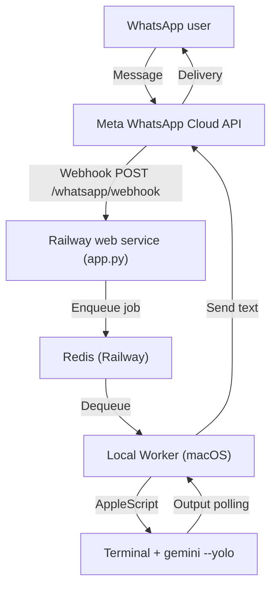

# BishopBot Meta (WhatsApp -> Gemini CLI Automations)

## What It Is

A WhatsApp-controlled automation bot that lets you trigger Gemini CLI workflows on a local macOS machine, with streaming logs back into WhatsApp.

- Transport: WhatsApp Cloud API webhook (Meta)
- Orchestration: Redis queue (Railway)
- Execution: macOS Terminal automation (AppleScript + System Events)
- UX: chat-first workflow with explicit control commands (`!enter`, `!y`, `!n`, `!status`, `!stop`)

## Why It Exists

Slack worked well for internal workflows, but WhatsApp is faster for mobile-first, on-the-go control. This extends the same internal “chat -> CLI automations” pattern to WhatsApp with minimal duplicated logic.

## Architecture

## What Makes It Enterprise-Grade

- Shared job model: WhatsApp and Slack reuse the same queue and worker handlers.
- Deterministic controls: explicit commands allow safe progression when the CLI is waiting for input.
- Output chunking: long logs are split for chat delivery.
- Optional webhook signature verification using `WHATSAPP_APP_SECRET`.
- Separation of concerns: webhook ingestion is stateless; execution happens only on the authorized local machine.

## Demo Script (Portfolio)

1. Show WhatsApp chat: send a prompt like: "Audit my homepage SEO and summarize fixes".
2. Show Railway logs receiving the webhook.
3. Show macOS Terminal session launched with `gemini --yolo` and the prompt injected.
4. Show WhatsApp streaming logs.
5. Simulate an interactive prompt: send `!enter` or `!y`.
6. Show final summary in WhatsApp.

## Screenshots To Capture

- Meta App dashboard with WhatsApp product enabled (no secrets visible)
- Webhook configuration screen showing callback URL (no token)
- WhatsApp chat showing streaming logs and control commands
- Terminal window running Gemini CLI
